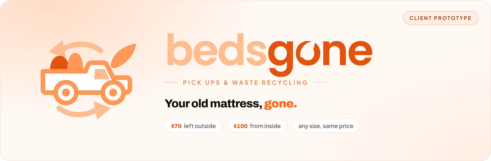
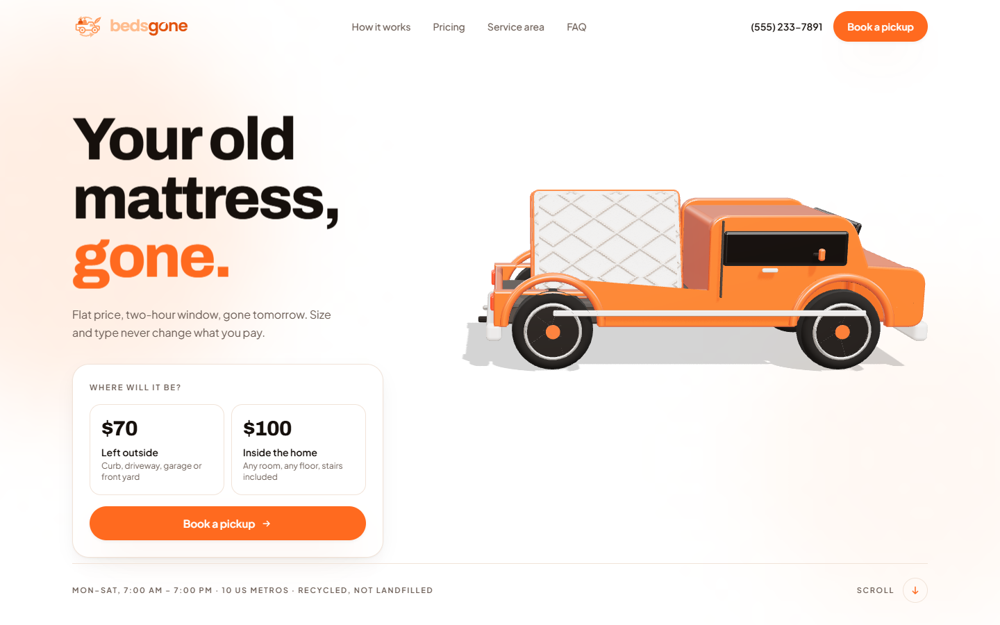
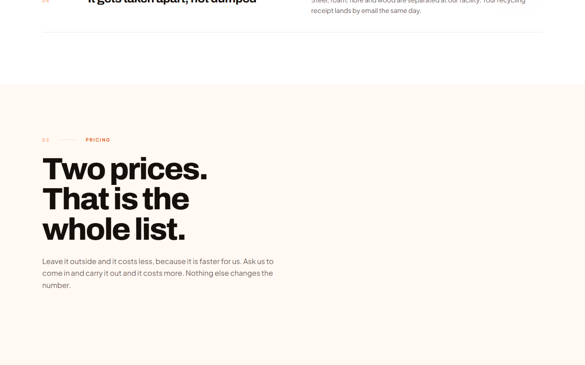
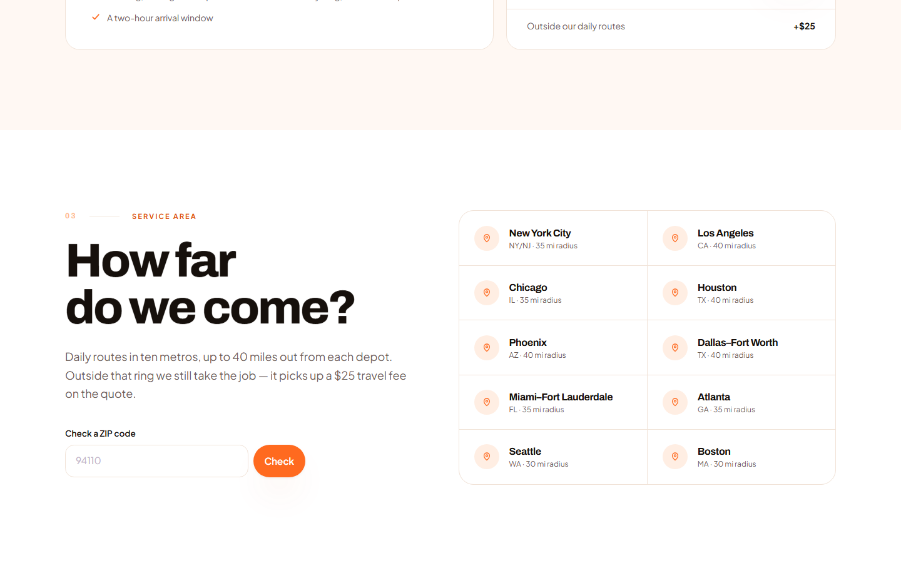
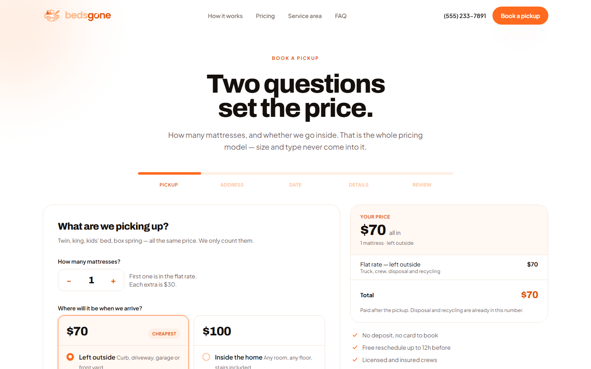
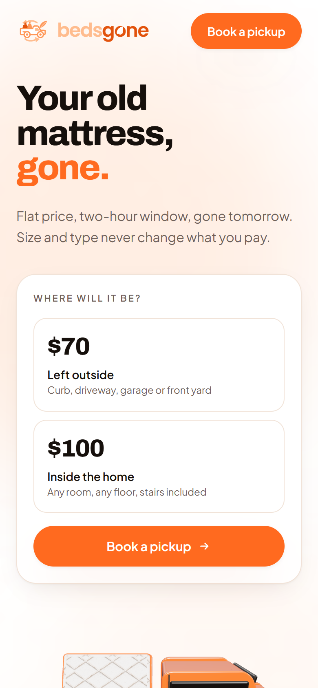
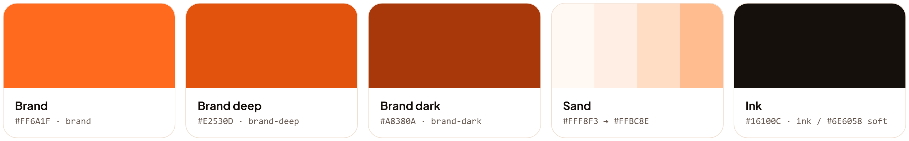

<p align="center">
  
</p>

<p align="center">
  
  
  
  
  
  
</p>

<p align="center">
  <b>A flat-rate mattress pickup website: a 3D landing page and a five-step booking flow with live pricing.</b>
</p>

---

> [!IMPORTANT]
> **This is a prototype, not a live business.**
> Bedsgone is a project a client asked for. This repository is the **prototype** built to
> show them the direction: the brand, the look and feel, the pricing model and the booking flow.
> No bookings are sent, stored or charged anywhere. The phone number, email, testimonials and
> service area are **placeholder content**. The site is not connected to a backend, payment
> provider or real dispatch system.

---

## Contents

- [At a glance](#at-a-glance)
- [Screenshots](#screenshots)
- [Quick start](#quick-start)
- [Project structure](#project-structure)
- [The pricing model](#the-pricing-model)
- [The booking wizard](#the-booking-wizard)
- [The 3D hero](#the-3d-hero)
- [Motion system](#motion-system)
- [Brand](#brand)
- [Connecting a backend](#connecting-a-backend)
- [Deploy](#deploy)
- [Prototype scope & next steps](#prototype-scope--next-steps)

---

## At a glance

| | |
| --- | --- |
| **What it is** | A marketing and booking site for a mattress pickup and recycling service |
| **The pitch** | Two flat prices. Size, type and age of the mattress never change what you pay |
| **Pages** | `/` landing page · `/book` booking wizard |
| **Stack** | [Astro 5](https://astro.build) · [Tailwind CSS 4](https://tailwindcss.com) · [three.js](https://threejs.org) · [GSAP](https://gsap.com) · [Lenis](https://lenis.darkroom.engineering) |
| **Output** | Fully static HTML/CSS/JS. Hosts anywhere, no server needed |
| **Status** | Client prototype, design and front end complete. No backend yet |

---

## Screenshots

<p align="center">
  
  <br /><sub><b>Hero.</b> The pickup drives in, the mattress drops into the bed, and the price card appears. Scrolling drives the truck away.</sub>
</p>

<table>
  <tr>
    <td width="50%"></td>
    <td width="50%"></td>
  </tr>
  <tr>
    <td align="center"><sub><b>Pricing:</b> two prices, and that is the whole list</sub></td>
    <td align="center"><sub><b>Service area:</b> ten metros, with a live ZIP checker</sub></td>
  </tr>
</table>

<table>
  <tr>
    <td width="68%"></td>
    <td width="32%"></td>
  </tr>
  <tr>
    <td align="center"><sub><b>/book:</b> five steps with a price that updates live</sub></td>
    <td align="center"><sub><b>Mobile:</b> fully responsive</sub></td>
  </tr>
</table>

---

## Quick start

Requires **Node 18.20.8+** (Node 20 or newer recommended).

```bash
npm install
npm run dev       # http://localhost:4321
```

| Script | What it does |
| --- | --- |
| `npm run dev` | Dev server with hot reload |
| `npm run build` | Static build into `dist/` |
| `npm run preview` | Serves the built `dist/` locally |
| `npm run check` | Astro and TypeScript type check |

---

## Project structure

```text
bedsgone/
├── public/
│   └── favicon.svg              # the logo mark
├── src/
│   ├── pages/
│   │   ├── index.astro          # landing page
│   │   └── book.astro           # booking wizard page
│   ├── layouts/
│   │   └── Base.astro           # <head>, fonts, header, footer, preloader
│   ├── components/
│   │   ├── Hero.astro           # headline + price card + 3D scene mount
│   │   ├── MattressScene.astro  # canvas wrapper for the three.js scene
│   │   ├── Marquee.astro        # scrolling strip of selling points
│   │   ├── HowItWorks.astro     # 01 — the steps
│   │   ├── PricingSection.astro # 02 — the two flat rates and the extras
│   │   ├── Coverage.astro       # 03 — metros + ZIP checker
│   │   ├── Testimonials.astro
│   │   ├── Faq.astro
│   │   ├── CtaBand.astro
│   │   ├── BookingWizard.astro  # the whole /book flow
│   │   ├── Header.astro · Footer.astro · Preloader.astro · SectionHead.astro
│   │   └── Logo.astro · LogoMark.astro   # brand, rebuilt as SVG
│   ├── lib/
│   │   ├── config.ts            # prices, fees, time windows, metros (single source of truth)
│   │   ├── quote.ts             # pure pricing math (buildQuote)
│   │   ├── hero-scene.ts        # the three.js truck + mattress scene
│   │   └── motion.ts            # Lenis, GSAP reveals, header, marquee, cursor
│   └── styles/
│       └── global.css           # Tailwind 4 @theme tokens + layered base/components
├── docs/                        # README images
├── astro.config.mjs
└── package.json
```

---

## The pricing model

The model is deliberately simple, and the whole site is built around it:

| Where is the mattress? | Price |
| --- | ---: |
| **Left outside**: curb, driveway, garage or front yard | **$70** |
| **Inside the home**: any room, any floor, stairs included | **$100** |

Size, type and age never change the price, so the form never asks. Only three extras exist:

| Extra | Fee |
| --- | ---: |
| Each mattress after the first | **+$30** |
| Same-day or next-day slot | **+$25** |
| Address outside the daily routes | **+$25** |

Everything lives in **[`src/lib/config.ts`](src/lib/config.ts)**: `PICKUP_SPOTS`, `EXTRA_MATTRESS`,
`RUSH_FEE`, `OUT_OF_AREA_FEE`, plus `TIME_WINDOWS`, the `SCHEDULING` rules and the `METROS`
list behind the ZIP checker. Change a number there and the landing page, the booking wizard
and the quote all update together.

The math is in **[`src/lib/quote.ts`](src/lib/quote.ts)** (`buildQuote`). It is made of pure
functions with no DOM access, so the same code can later run on a server or in tests as is.

---

## The booking wizard

[`src/components/BookingWizard.astro`](src/components/BookingWizard.astro), at `/book`.

| # | Step | What it asks |
| --- | --- | --- |
| 1 | **Pickup** | How many mattresses, and outside or inside. This sets the price |
| 2 | **Address** | Street, city, state, ZIP with live coverage feedback, plus parking and gate-code notes |
| 3 | **Date & time** | Quick-pick chips for the soonest openings, any date within 30 days, two-hour windows |
| 4 | **Details** | Name, email, phone, SMS opt-in, notes |
| 5 | **Review** | A per-section summary with Edit links, then confirm |

- **Live price.** The quote panel recalculates on every change.
- **Drafts persist.** The form is saved to `localStorage`, so a reload does not lose it.
- **Deep links.** `/book?spot=inside&zip=90038` pre-fills the form.
- **Mobile.** The steps collapse and a sticky bottom bar carries the price and the Next button.

---

## The 3D hero

[`src/lib/hero-scene.ts`](src/lib/hero-scene.ts) is a small, hand-built three.js scene. No model
files are loaded; the truck and the mattress are built from geometry.

1. The pickup drives in from the left and settles on its springs.
2. The mattress falls in on a diagonal, catches its edge on the bed floor and drops into the bed.
3. The price card is revealed (the scene fires a `bg:loaded` event on `window`).
4. Scrolling drives the truck off to the right, wheels turning, with the mattress on board.

The scene is loaded with a dynamic `import()` and only after a WebGL check, so three.js never
reaches a device that cannot render it.

---

## Motion system

[`src/lib/motion.ts`](src/lib/motion.ts) contains Lenis smooth scroll and a small GSAP reveal
system driven by `data-anim` attributes (`lines`, `fade`, `stagger`, `clip`, `parallax`). It also
handles the sticky header, the marquee and the custom cursor.

**All motion is turned off under `prefers-reduced-motion`.**

Two things to know before editing the motion code:

- `gsap.ticker.lagSmoothing(0)`, the line most Lenis guides tell you to add, must stay
  **off**. With it on, a single main-thread stall makes GSAP fast-forward, and the loader and
  the whole drop animation jump straight to the end.
- Custom CSS lives inside `@layer base` / `@layer components` in `global.css`. Unlayered CSS
  outranks every Tailwind utility, so a plain `.btn` would override `px-5`, and
  `.link-underline` would override `hidden`.

---

## Brand

<p align="center">
  
</p>

**Logo.** The pickup, the leaf and the recycling loop are rebuilt as SVG, so the logo stays
sharp at every size, from the 30px favicon to the loader.

- [`LogoMark.astro`](src/components/LogoMark.astro): the mark on its own (`invert` for dark backgrounds)
- [`Logo.astro`](src/components/Logo.astro): `wordmark` (the leaf sits inside the "o") or the full
  `lockup` with the *Pick ups & waste recycling* tagline

**Colour tokens** are defined in [`src/styles/global.css`](src/styles/global.css) under `@theme`,
so each one is also a Tailwind utility (`bg-brand`, `text-ink-soft`, `border-line`…).

| Token | Hex | Use |
| --- | --- | --- |
| `brand` | `#FF6A1F` | Primary actions, highlights, prices |
| `brand-deep` | `#E2530D` | Logo "gone", hover states, eyebrow labels |
| `brand-dark` | `#A8380A` | Text on sand, selection |
| `sand-50` → `sand-300` | `#FFF8F3` `#FFEEE3` `#FFDCC4` `#FFBC8E` | Section backgrounds, badges, logo "beds" |
| `ink` | `#16100C` | Headlines and body text |
| `ink-soft` | `#6E6058` | Secondary text |
| `line` | `#F1E3D8` | Borders and dividers |

**Typography** (Google Fonts):

| Role | Font |
| --- | --- |
| Display / headlines | **Archivo** 700–900, tight tracking |
| Body / UI | **Plus Jakarta Sans** 400–700 |
| Logo wordmark | **Poppins** 600 |

---

## Connecting a backend

The form is front-end only for now. There is one place to connect a server:
`submitBooking()` at the bottom of `BookingWizard.astro`.

```js
await fetch('/api/bookings', {
  method: 'POST',
  headers: { 'Content-Type': 'application/json' },
  body: JSON.stringify(payload),
});
```

`payload` is `{ reference, submittedAt, booking, quote }`. A Supabase insert, a Resend email or a
Formspree endpoint can each go at that call without changing anything else. In the prototype,
submitted bookings are logged to the console and kept in `localStorage` under
`bedsgone:bookings`, so they can be inspected during a demo.

---

## Deploy

```bash
npm run build
```

Upload `dist/` to any static host: Vercel, Netlify, Cloudflare Pages, GitHub Pages, S3 or cPanel.

> `playwright` is a devDependency used only to take screenshots of the built site during
> development (including the images in this README). The shipped site does not depend on it.

---

## Prototype scope & next steps

**Done in the prototype**

- [x] Brand: logo as SVG, colour tokens, typography
- [x] Landing page: 3D hero, how it works, pricing, service area, testimonials, FAQ
- [x] Five-step booking wizard with live pricing, draft saving and deep links
- [x] Responsive layout, keyboard focus states, reduced-motion support
- [x] Pricing and service-area rules in a single config file

**Needed before going live** *(to be agreed with the client)*

- [ ] Backend for bookings (database + confirmation email/SMS)
- [ ] Payment, or a confirmed pay-after-pickup process
- [ ] Real availability / dispatch integration instead of open time windows
- [ ] Real contact details, service area, testimonials and legal pages (terms, privacy)
- [ ] Analytics and SEO metadata per page
- [ ] Domain and production hosting

---

<p align="center">
  
  <br />
  <sub><b>Bedsgone</b> · Pick ups & waste recycling<br />
  Client prototype by <a href="https://github.com/rodrigofariarocha">Rodrigo Faria Rocha</a>. All business details shown are placeholders.</sub>
</p>
